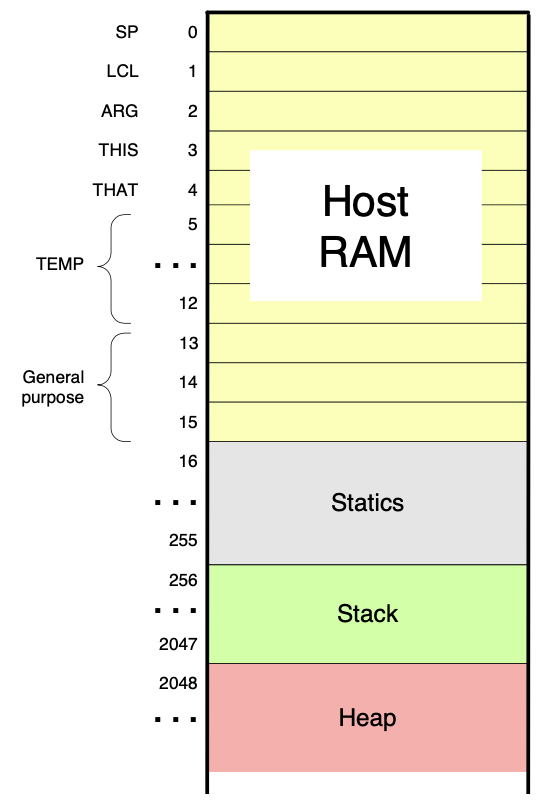

#编译器
## 目标
将 vm语言翻译成为 hack的汇编语言
## 导言
vm语言中分为四种列席的语言:
数据和逻辑命令,存储空间逻辑,程序流程逻辑,函数调用逻辑
我们分为两部分,第一部分包括数据和逻辑命令,存储空间逻辑;第二部分包括 程序流程逻辑和函数调用逻辑
## 第一部分
### 数据逻辑命令
> add 加法

> sub 减法

> neg  取反

> eq  等于

> gt  大于

> lt  小于

> and  与

> or  或

> not  非

//todo 这些基础指令如何和 hack指令信息对应

### 存储空间访问命令
> pop x  (弹出一个变量x,把结果赋值给x对应的变量)

> push y (y是一个变量或者是常量,将参与运算) 

### 将以上的两种操作,翻译为hack
hack语言中有D,A,M指令的操作.
这里应该如何将 push ,pop 的内存访问命令和 数据逻辑命令映射到Hack命令.
#### 内存空间如何组织
因为vm中使用了push,pop类型的模型,所以,当我们将push,pop变量的时候,这些变量应该放在内存中的位置.
对于面向对象来说,有四种类型的数据,static,成员变量,函数参数,局部变量这四种,放在四个内存段中 `static`,`this`,`local`,`argument`四种内存段.
对于系统中还有额外的四个空间:`that`,`constant`,`pointer`,`temp`.这四个内存区域.

由于指定了8个不同的编译器,push,pop命令做了变更,变更如下:
``` asml
push memorySegment index;
pop  memorySegment index;
```
其中 memorySegment表示对应的内存段的区间,index是一个非负数.
所以我们在当前的编译器处理的pop命令和push和当前命令中是一致的

##### 内存映射


##### 寻址方式的翻译方式
根据内存地址映射方式,`SP`,`LCL`,`ARG`,`THIS`,`THAT`使用的方式是间接寻址,
`TEMP`和`R[13-15]`这些地址的适用方式是直接寻址.
其中`CONSTANT`使用的是立即数寻址方式.
对于系统中,不同的命令形式.从`pop stackName value` 和 `push stackName value`编译的方式如下.
Hack中有两个寄存器,D寄存器,只能存放数据.A寄存器能存放数据和地址.同时适用M指令实现对A寄存器中对应地址的的操作.

`push constant 12`
这个是一个间接寻址的,且将对应的结果设置到 `SP`指定的地址上.`SP`寄存器是特殊使用的寄存器.
```text
//将结果设置到 SP对应的地址上.
@12
D=A //因为是立即数,所以将对应的设置到D寄存器中
@SP
A=M  //获取到到地址
M=D  //将地址设置到 M寄存其中
@SP  //重新将SP的地址设置到 A寄存器
M=M+1  //将SP寄存器+1,指向下一个使用的地址
  
```

`push arg 5`
这条指令的含义是将arg数组中的第5个位置的元素添加到SP堆栈中.这条指令也是适用间接寻址
```text
//arg是一个基址. 5是偏移量. 计算真正地址并将地址写到A寄存器
@5
D=A
@ARG
A=M+D

//将数据取出来放到D中
D=M
//写到stack中,并更新指针地址
@SP
A=M
M=D
@SP
M=M+1
```

`pop temp 6`
这条指令的含义是将当前栈顶的数据取出来,存放在 temp +6 的位置上.temp是一个直接寻址的方式
```text
//从堆栈顶部获取一个数据到D寄存器中.并更新栈顶地址
//出栈
@SP
A=M
D=M
@SP
M=M-1

//将D寄存器存放到temp6地址中去. 在hack语言中没有办法进行计算了,所以必须将这个地址在翻译的时候确定.
@11    //temp6  == 5+6 = 11
M=D

```

`pop that 5`
这条指令是将 栈顶数据取出来,放在 D中,然后将元素写到 that 栈中 第5个元素的位置.
因为只有D+A寄存器,这两个寄存器都需要用来参与运算.这个时候适用temp0寄存器,展示记录存储结果.

```text
//计算出 that + 5 寄存器的地址,并存放在temp0的位置
@THAT
D=M
@5
D=D+A
@temp
M=D
//出栈  + 写入 元素以及写到了D寄存器中了.
@SP
A=M-1
D=M
@temp
A=M
M=D

//temp地址设置为0
@temp
M=0
//这个时候应该如何讲目标地址写到A寄存器中
```

栈的操作原则中,是从栈顶的两个元素弹出,下面一个元素-上面一个元素.
`add`
add指令是将栈顶的两个元素出栈,然后进行相加.然后将结果重新写到栈顶中.
```text
//将栈顶指针-1
@SP
A=M-1
D=M
@SP
M=M-1

//将第二个元素直接去除来并相加
//将结果写到RAM[@SP]的位置上,并设置结果.
@SP
A=M-1
D=M+D
@SP
A=M-1
M=D
```

`eq,gt,lt`
这三个指令需要使用的是 需要用jmp指令.主要是D:JMP 这两种试下.D:JGT等
以eq为例,先适用sub,将最终结果写在D寄存器中,然后根据 eq,gt,lt 确定使用那种JMP,并确定跳转到合适的结果中.
eq true = -1
eq false = 0
lt true = -1
lt false = 0

gt true = -1
gt false = 0

```text
@SP
A=M-1
D=M
@SP
M=M-1

@SP
A=M-1
A=M

//用下面一个元素-上面一个元素
D=M-D

//更新@SP的地址可以不更新,一会跳转到俄时候可能会适用.
@IS_TRUE
D;JEQ 
@IS_FALSE
D;JNE
(IS_TRUE)
//向栈顶添加 -1,这个时候SP是没有更新的.
@-1
D=A
@SP
A=M-1
M=D
@END
0;JMP
(IS_FALSE)
 //想栈顶添加 0 , 这个时候SP还没有更新.
 @0
 D=A
 @SP
 A=M-1
 M=D
@END
0;JMP
(END)


```


